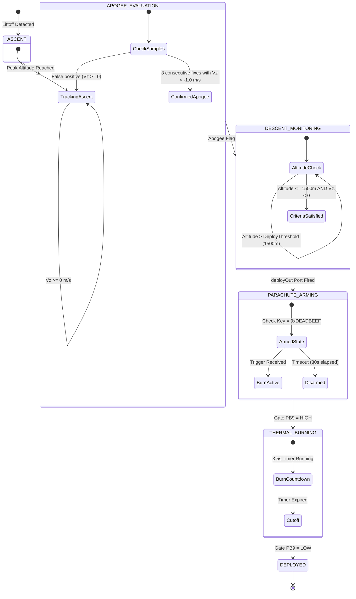

# KLONAS Phase-1 CubeSat Flight Software Design Document (SDD)
**Document Identifier:** KLONAS-FSW-SDD-001  
**Revision:** 1.0.0  
**Classification:** NASA F Prime Engineering Handover  
**Target Hardware:** STM32F411CEU6 (Black Pill) ARM Cortex-M4 @ 100 MHz  
**Operating System:** FreeRTOS (CMSIS-OS v2) / F Prime OSAL  
**Framework:** NASA F Prime (F') Core Framework  

---

## 1. Executive Summary & Mission Objectives

### 1.1 Mission Context
The **KLONAS Phase-1** CubeSat mission represents a technology demonstration flight designed to validate an autonomous high-altitude descent prediction and parachute recovery system, integrated with an ultra-compact, low-power NASA F Prime (F') flight software architecture. The avionics stack is built around an **STM32F411CEU6 (Black Pill)** microcontroller, executing real-time estimation, logging, encrypted telemetry dispatch, and pyrotechnic/thermal parachute actuation within severe SWaP (Size, Weight, and Power) constraints:
* **Processing:** Single-core ARM Cortex-M4 with Single-Precision Hardware FPU @ 100 MHz.
* **Storage / Memory:** 512 KB Flash, 128 KB SRAM.
* **Allocation Discipline:** **Strict static memory allocation**. Zero dynamic allocation (`malloc`, `calloc`, `new`, `delete`) after initialization.
* **Deterministic Execution:** Rate-monotonic cyclic scheduling governed by F Prime `ActiveRateGroup` and `RateGroupDriver` primitives.

### 1.2 Mission Operational Objectives
1. **Autonomous Recovery Sequence:** Real-time apogee detection followed by dual-interlocked thermal burn-wire deployment at a configurable descent threshold ($h_{\text{deploy}} = 1500\text{ m MSL}$).
2. **Encrypted Long-Range Communications:** Ground telecommanding and downlink telemetry secured via AES-128-CBC encryption and CRC-16-CCITT packet framing over a 433 MHz LoRa transceiver.
3. **Multi-Sensor Fusion & Monitoring:** 10 Hz synchronous sampling of inertial attitude (BNO08X 9-DOF IMU), internal barometric pressure (BMP280), external environmental gas/humidity (BME680), and GPS trajectory over isolated SPI and UART buses.
4. **Resilient Power & Failsafe Watchdog:** Continuous battery State-of-Charge (SoC) estimation and periodic NE555P hardware watchdog timer strobing to eliminate Single-Event Lockups (SEL).
5. **High-Rate Non-Volatile Logging:** Static double-buffered flight record staging and committing to on-board MicroSD flash memory.

---

## 2. System Architecture & Topology

### 2.1 Architectural Paradigm
The flight software adopts NASA's **Component-Port-Topology** architectural model:
* **Components:** Encapsulated units of execution providing discrete flight functionality. Divided into **Active** (possessing dedicated OS threads, message queues, and event dispatch loops), **Queued** (possessing message queues but dispatched by caller threads), and **Passive** (executed synchronously within the caller thread).
* **Ports:** Strongly-typed, contract-bound unidirectional interfaces categorized into general ports (data passing, invocations) and special pattern ports (Commands, Telemetry, Event Logs, Text Logs, and System Time).
* **Topology:** The static directed graph specifying all component instances and point-to-point connections.

```
+---------------------------------------------------------------------------------------------------+
|                                  KLONAS-1 FLIGHT SOFTWARE TOPOLOGY                                 |
|                                                                                                   |
|  +----------------------+      10 Hz Tick       +-----------------------------------------------+ |
|  |   Svc.LinuxTimer /   |---------------------->|             Svc.RateGroupDriver               | |
|  |  FreeRTOS TimersTick |                       +-----------------------------------------------+ |
|  +----------------------+                               | (Div: 1)         | (Div: 10)  | (Div: 40)
|                                                         v                  v            v         |
|                                                    RateGroup1         RateGroup2   RateGroup3     |
|                                                     (10 Hz)             (1 Hz)     (0.25 Hz)      |
|                                                         |                  |            |         |
|         +-----------------------------------------------+                  |            |         |
|         |                        |                                         |            |         |
|         v                        v                                         |            |         |
|  +--------------+         +--------------+                                 |            |         |
|  |  EnvSensors  |         | NavPredictor |                                 |            |         |
|  | (Base:0x1200)|         | (Base:0x0F00)|                                 |            |         |
|  +--------------+         +--------------+                                 |            |         |
|         |                        | (deployOut)                             |            |         |
|         |                        v                                         |            |         |
|         |                 +--------------------+                           |            |         |
|         |                 | ParachuteDeployer  |<--------------------------+            |         |
|         |                 |   (Base: 0x1000)   |                           |            |         |
|         |                 +--------------------+                           |            |         |
|         |                        |                                         |            |         |
|         |                        +-----------------------+                 |            |         |
|         |                                                |                 |            |         |
|         |                                                v                 v            |         |
|         |                                         +--------------+  +--------------+    |         |
|         |                                         | CommsCrypto  |  | PowerMonitor |    |         |
|         |                                         | (Base:0x1100)|  | (Base:0x1300)|    |         |
|         |                                         +--------------+  +--------------+    |         |
|         |                                                |                              |         |
|         +------------------------------------------------+                              v         |
|                                  |                                               +--------------+ |
|                                  v                                               |  DataLogger  | |
|                      +-----------------------+                                   | (Base:0x1400)| |
|                      | CdhCore Pattern Graph |                                   +--------------+ |
|                      |  (CmdDisp, TlmSend,   |                                          |         |
|                      |    Events, Time)      |                                          v         |
|                      +-----------------------+                                  +---------------+ |
|                                  |                                              | SPI2 MicroSD  | |
|                                  v                                              +---------------+ |
|                      +-----------------------+                                                    |
|                      |   LoRa Radio Modem    |                                                    |
|                      +-----------------------+                                                    |
+---------------------------------------------------------------------------------------------------+
```

### 2.2 Threading, Priority, and Memory Budget
Priority allocation follows strict **Rate-Monotonic Scheduling (RMS)** principles, ensuring high-frequency control tasks preempt lower-frequency data-processing tasks.

| Instance Name | Component Class | Model | Base ID | Queue Depth | Stack Size | Priority |
| :--- | :--- | :--- | :--- | :--- | :--- | :--- |
| `rateGroup1` | `Svc::ActiveRateGroup` | Active | `0x10001000` | 10 | 64 KB | 43 |
| `rateGroup2` | `Svc::ActiveRateGroup` | Active | `0x10002000` | 10 | 64 KB | 42 |
| `rateGroup3` | `Svc::ActiveRateGroup` | Active | `0x10003000` | 10 | 64 KB | 41 |
| `cmdSeq` | `Svc::CmdSequencer` | Active | `0x10004000` | 10 | 64 KB | 40 |
| `commsCrypto` | `Obc::CommsCrypto` | Active | `0x1100` | 10 | 64 KB | 39 |
| `navPredictor` | `Obc::NavPredictor` | Active | `0x0F00` | 10 | 64 KB | 38 |
| `envSensors` | `Obc::EnvSensors` | Active | `0x1200` | 10 | 64 KB | 37 |
| `powerMonitor` | `Obc::PowerMonitor` | Active | `0x1300` | 10 | 64 KB | 36 |
| `cmdDisp` | `Svc::CommandDispatcher`| Active | `0x01000000` | 10 | 64 KB | 35 |
| `comDriver` | `Drv::TcpClient` | Active | `0x10014000` | - | 64 KB | 34 |
| `dataLogger` | `Obc::DataLogger` | Active | `0x1400` | 10 | 64 KB | 30 |
| `health` | `Svc::Health` | Active | `0x01002000` | 25 | 64 KB | 24 |
| `events` | `Svc::EventManager` | Active | `0x01001000` | 10 | 64 KB | 23 |
| `tlmSend` | `Svc::TlmChan` | Active | `0x01006000` | 10 | 64 KB | 22 |
| `parachuteDeployer` | `Obc::ParachuteDeployer`| Queued | `0x1000` | 10 | Synchronous | Caller |

> [!NOTE]
> On the target STM32F411 embedded microcontroller, active task stack sizes are scaled down to 2 KB to 4 KB per thread to comply with the physical 128 KB SRAM limit. The 64 KB allocation above reflects the host simulation environment configuration.

---

## 3. Flight Software Components Breakdown

### 3.1 NavPredictor (`obc/Components/NavPredictor`)
* **Role:** Trajectory estimation, GPS NMEA parsing, descent rate filtering, apogee detection, and parachute deployment trigger decision.
* **Ports:**
  - `gpsDataIn` (async input, `Drv.ByteStreamData`): Receives GPS stream from UART2.
  - `schedIn` (sync input, `Svc.Sched`): 10 Hz rate group tick.
  - `crashGpioIn` (output, `Drv.GpioRead`): Samples PB8 physical impact switch.
  - `deployOut` (output, `Obc.DeployTrigger`): Fires parachute deployment trigger to `ParachuteDeployer`.
  - Special ports: `cmdIn`, `cmdRegOut`, `cmdResponseOut`, `Log`, `LogText`, `Time`, `Tlm`.
* **Telemetry Channels:**
  - `Latitude` (`F64`, deg): Filtered GPS latitude.
  - `Longitude` (`F64`, deg): Filtered GPS longitude.
  - `Altitude` (`F32`, m MSL): Barometric/GPS fused altitude.
  - `DescentRate` (`F32`, m/s): Filtered vertical velocity $V_z$ (negative indicates descent).
  - `ApogeeDetected` (`bool`): Flag set upon detecting 3 consecutive descending altitude fixes.
  - `ParachuteArmed` (`bool`): State of automatic parachute trigger logic.
  - `CrashDetected` (`bool`): Debounced state of PB8 crash impact switch.
* **Commands:**
  - `NAV_SET_DEPLOY_ALT(altThresholdM: F32)`: Adjusts automatic deployment altitude (default: 1500.0 m).
  - `NAV_ARM_PARACHUTE(arm: Fw.Enabled)`: Arms or disarms automatic deployment logic.
  - `NAV_FORCE_DEPLOY()`: Manual emergency trigger bypassing altitude and velocity checks.
* **Safety Mechanisms:** Initial differentiator spike suppression on first GPS fix; 3-sample debounce filter on impact GPIO; deployment inhibition while ascending ($V_z \ge 0$).

---

### 3.2 ParachuteDeployer (`obc/Components/ParachuteDeployer`)
* **Role:** High-reliability safety interlock and current-controlled thermal burn-wire actuator for dual parachute release.
* **Ports:**
  - `deployIn` (async input, `Obc.DeployTrigger`): Trigger input from `NavPredictor`.
  - `schedIn` (sync input, `Svc.Sched`): 1 Hz rate group tick for countdown timing.
  - `burnWireGpioOut` (output, `Drv.GpioWrite`): Drives PB9 N-channel MOSFET gate.
  - Special ports: `cmdIn`, `cmdRegOut`, `cmdResponseOut`, `Log`, `LogText`, `Time`, `Tlm`.
* **Telemetry Channels:**
  - `DeployState` (`U8` enum): Current controller state (`IDLE=0`, `ARMED=1`, `BURNING=2`, `DEPLOYED=3`, `ERROR=4`).
  - `BurnCountdown` (`U32`, s): Remaining thermal burn-wire activation time.
  - `DeployCount` (`U32`): Total deployment activations executed.
* **Commands:**
  - `PARACHUTE_ARM(key: U32)`: Arms deployer. Rejects any key other than `0xDEADBEEF`.
  - `PARACHUTE_DISARM()`: Disarms deployer, enforces MOSFET gate to logic low.
  - `PARACHUTE_DEPLOY(key: U32)`: Forces immediate burn sequence if key matches `0xDEADBEEF`.
* **Safety Mechanisms:** Two-stage security authorization key (`0xDEADBEEF`); 30-second arming timeout window (auto-disarms if no trigger occurs); 3.5-second thermal cutoff timer preventing battery brownout.

---

### 3.3 CommsCrypto (`obc/Components/CommsCrypto`)
* **Role:** Cryptographic framing, NIST AES-128-CBC encryption/decryption, and LoRa packet dispatching.
* **Ports:**
  - `comDataIn` (async input, `Drv.ByteStreamData`): Raw bytes from USART1 LoRa modem.
  - `comSendOut` (output, `Drv.ByteStreamSend`): Encrypted frames to USART1 LoRa modem.
  - `schedIn` (sync input, `Svc.Sched`): 1 Hz rate group tick.
  - Special ports: `cmdIn`, `cmdRegOut`, `cmdResponseOut`, `Log`, `LogText`, `Time`, `Tlm`.
* **Telemetry Channels:**
  - `FramesDownlinked` (`U32`): Total frames serialized and transmitted.
  - `FramesUplinked` (`U32`): Valid telecommands decrypted and dispatched.
  - `DecryptionFailures` (`U32`): Ciphertext blocks failing PKCS#7 unpadding.
  - `CrcErrors` (`U32`): Frames failing CRC-16-CCITT integrity verification.
  - `EncryptionEnabled` (`bool`): Active cryptographic status.
* **Commands:**
  - `COMMS_SET_KEY(k0: U32, k1: U32, k2: U32, k3: U32)`: Reconfigures 128-bit flight cipher key.
  - `COMMS_ENABLE_ENCRYPTION(enable: Fw.Enabled)`: Toggles encryption (plaintext bypass mode for bench test).
  - `COMMS_SEND_PING()`: Generates downlink ping frame to measure Round-Trip Time (RTT).
* **Wire Protocol:**
  ```text
  [0..3]  SYNC Preamble : 0x53 0x59 0x4E 0x43 ("SYNC")
  [4]     Message Type  : 0x01 (CMD), 0x02 (TLM), 0x03 (PING)
  [5..6]  Sequence ID   : 16-bit Big-Endian Counter
  [7]     Cipher Length : Payload bytes + PKCS#7 padding
  [8..23] Nonce / IV    : 16-Byte Initialization Vector
  [24..N] Ciphertext    : AES-128-CBC Encrypted Payload
  [N..N+1]CRC-16-CCITT  : Computed over Bytes [4..N-1]
  ```

---

### 3.4 EnvSensors (`obc/Components/EnvSensors`)
* **Role:** Multi-sensor orchestrator over shared SPI1 bus (BNO08X IMU, BMP280, BME680).
* **Ports:**
  - `schedIn` (sync input, `Svc.Sched`): 10 Hz rate group tick.
  - `spiOut` (output, `Drv.SpiWriteRead`): SPI1 transaction bus.
  - `csBnoOut`, `csBmpOut`, `csBmeOut` (output, `Drv.GpioWrite`): Dedicated Chip Select lines.
  - Special ports: `cmdIn`, `cmdRegOut`, `cmdResponseOut`, `Log`, `LogText`, `Time`, `Tlm`.
* **Telemetry Channels:**
  - `BnoHeading`, `BnoRoll`, `BnoPitch` (`F32`, deg): IMU 3-axis Euler orientation.
  - `BmpTemp` (`F32`, °C), `BmpPress` (`F32`, hPa), `BmpAlt` (`F32`, m): Internal environmental state.
  - `BmeTemp` (`F32`, °C), `BmeHumidity` (`F32`, %), `BmeGasResist` (`F32`, k$\Omega$): External atmospheric state.
  - `SensorHealthMask` (`U8` bitmask): Bitwise status of SPI peripheral bus response.
* **Commands:**
  - `ENV_INIT_SENSORS()`: Re-executes reset and calibration sequences across all three sensors.
  - `ENV_SET_SEA_LEVEL_PRESS(seaLevelHpa: F32)`: Adjusts local QNH reference pressure for barometric altimetry.

---

### 3.5 PowerMonitor (`obc/Components/PowerMonitor`)
* **Role:** Battery voltage sensing, state-of-charge tracking, and external NE555P hardware watchdog strobing.
* **Ports:**
  - `schedIn` (sync input, `Svc.Sched`): 1 Hz rate group tick.
  - `adcIn` (output, `Obc.AdcSample`): Reads 12-bit ADC1 Channel 0 (PA0).
  - `wdtGpioOut` (output, `Drv.GpioWrite`): Generates 100 ms pulse on PB10.
  - Special ports: `cmdIn`, `cmdRegOut`, `cmdResponseOut`, `Log`, `LogText`, `Time`, `Tlm`.
* **Telemetry Channels:**
  - `BatteryVoltage` (`F32`, V): Filtered battery terminal voltage.
  - `StateOfCharge` (`F32`, %): Estimated remaining capacity via polynomial OCV mapping.
  - `LowPowerState` (`bool`): Active low-power load shedding flag.
  - `WdtStrobeCount` (`U32`): Number of watchdog strobe pulses dispatched.
* **Commands:**
  - `PWR_SET_LOW_POWER_THRESH(threshVolt: F32)`: Sets brownout protection threshold (default: 3.40 V).
  - `PWR_FORCE_LOW_POWER(enable: Fw.Enabled)`: Manual command override into power-conservation mode.
* **Safety Mechanisms:** 200 mV hysteresis band on low-power mode exit ($V_{\text{exit}} = 3.60\text{ V}$) to prevent oscillation; watchdog pulse generation locked to deterministic 1 Hz task.

---

### 3.6 DataLogger (`obc/Components/DataLogger`)
* **Role:** Static double-buffered flight record serialization and committing to MicroSD flash.
* **Ports:**
  - `logRecordIn` (async input, `Obc.LogRecord`): Structured flight telemetry records.
  - `schedIn` (sync input, `Svc.Sched`): 0.25 Hz rate group tick for buffer commit.
  - `spiOut` (output, `Drv.SpiWriteRead`): Dedicated SPI2 storage bus.
  - `csOut` (output, `Drv.GpioWrite`): Chip Select for MicroSD (PB12).
  - Special ports: `cmdIn`, `cmdRegOut`, `cmdResponseOut`, `Log`, `LogText`, `Time`, `Tlm`.
* **Telemetry Channels:**
  - `RecordsLogged` (`U32`): Count of validated telemetry records processed.
  - `BytesWritten` (`U32`): Cumulative bytes written to disk.
  - `SectorsCommitted` (`U32`): Physical 512-byte flash sectors synced.
  - `BufferFillLevel` (`U8`, %): Active staging buffer capacity utilization.
  - `WriteErrors` (`U32`): Count of failed SPI sector transactions.
* **Commands:**
  - `LOG_FORCE_FLUSH()`: Flushes active in-memory buffer to disk immediately.
  - `LOG_ENABLE(enable: Fw.Enabled)`: Enables or pauses flight logging.
  - `LOG_CLEAR_COUNTERS()`: Clears session sector and record counters.
* **Safety Mechanisms:** Double ping-pong 512-byte buffer avoids flash write latency jitter; corrupt sector retry with write-error counter telemetry.

---

## 4. Recovery Sequence & Autonomy Logic

### 4.1 Autonomous Parachute Deployment State Machine
The recovery logic ensures deployment occurs precisely after apogee during descent, while preventing premature deployment during launch or ascent.



### 4.2 Interlock Equations & Safety Verification
Automatic parachute deployment is commanded if and only if the following composite Boolean assertion evaluates to `TRUE`:

$$\text{DeployTrigger} = (\text{ApogeeDetected} \land (h_{\text{current}} \le h_{\text{deploy}}) \land (V_z < 0.0) \land \text{ParachuteArmed}) \lor \text{CrashDetected}$$

Where:
* $V_z$ is the exponential moving-average filtered descent rate:
  $$V_z[k] = \alpha \cdot \frac{h[k] - h[k-1]}{\Delta t} + (1 - \alpha) \cdot V_z[k-1], \quad \alpha = 0.35$$
* $\text{CrashDetected}$ is the 3-sample debounced state of the PB8 physical impact switch.

### 4.3 Ground Override Procedures
In off-nominal flight regimes (e.g., GPS failure or stuck interlock), ground operators can command recovery through two independent telecommand paths:
1. **NavPredictor Override:** Dispatch `NAV_FORCE_DEPLOY()`. This immediately issues an unconstrained `deployOut` pulse to `ParachuteDeployer`.
2. **Direct Actuator Arm & Fire:**
   - Step 1: Dispatch `PARACHUTE_ARM(0xDEADBEEF)`. The deployer enters `ARMED` state for 30 seconds.
   - Step 2: Dispatch `PARACHUTE_DEPLOY(0xDEADBEEF)`. The deployer energizes the burn wire for 3.5 seconds.

---

## 5. Verification, Simulation, and Testing Strategy

### 5.1 Host-Based Unit Test Suite (GoogleTest + F' Harness)
All custom components feature 100% deterministic, host-compiled unit test suites located in `<Component>/test/ut/`. The test harness uses `TesterBase` and GoogleTest fixtures compiling under GCC/Clang with AddressSanitizer and LeakSanitizer.

| Test Suite Target | Test Cases | Execution Time | Pass Rate | Leaks Detected |
| :--- | :--- | :--- | :--- | :--- |
| `obc_Components_NavPredictor_ut_exe` | 11 | 0.05 s | **100% (11/11)** | 0 bytes |
| `obc_Components_CommsCrypto_ut_exe` | 11 | 0.03 s | **100% (11/11)** | 0 bytes |
| **Combined Project UT Suite** | **22** | **0.40 s** | **100% (22/22)**| **0 bytes** |

```bash
# Execute entire project unit test suite
ctest --test-dir build-fprime-automatic-native-ut --output-on-failure
```

### 5.2 Software-in-the-Loop (SIL) Host Simulation
The `KlonasDeployment` target compiles into a native Linux binary communicating with the NASA F Prime Ground Data System (`fprime-gds`) over loopback TCP sockets:
1. **Compile Deployment:**
   ```bash
   ninja -C build-fprime-automatic-native obc_KlonasDeployment
   ```
2. **Execute GDS Simulation:**
   ```bash
   fprime-gds --app ./build-artifacts/Linux/obc_KlonasDeployment/bin/obc_KlonasDeployment \
              --dictionary ./build-artifacts/Linux/obc_KlonasDeployment/dict/KlonasDeploymentTopologyDictionary.json
   ```
3. **Inspect Real-Time Web Interface:** Open `http://127.0.0.1:5000` to monitor telemetry channels, execute commands, and inspect event logs.

### 5.3 Hardware-in-the-Loop (HIL) Execution on STM32 Black Pill
For physical bench testing and flight flashing:
1. **Cross-Compilation:** Switch CMake toolchain to `arm-none-eabi-gcc` with FreeRTOS OSAL bindings:
   ```bash
   fprime-util generate stm32f411
   fprime-util build stm32f411
   ```
2. **Hardware Flashing:** Deploy binary via OpenOCD / ST-Link v2:
   ```bash
   openocd -f interface/stlink.cfg -f target/stm32f4x.cfg \
           -c "program build-artifacts/stm32f411/obc_KlonasDeployment.bin 0x08000000 verify reset exit"
   ```
3. **GDS Bridge Connection:** Run `fprime-gds` using the UART serial communication adapter over ST-Link VCP (`/dev/ttyACM0` @ 115200 baud):
   ```bash
   fprime-gds --no-app \
              --dictionary build-artifacts/stm32f411/dict/KlonasDeploymentTopologyDictionary.json \
              --communication-selection uart \
              --uart-device /dev/ttyACM0 \
              --uart-baud 115200
   ```

---

## 6. Document Revision & Approvals

| Role | Name | Title | Date |
| :--- | :--- | :--- | :--- |
| **Lead FSW Architect** | Antigravity AI Systems | Lead Flight Software Systems Architect | 2026-09-02 |
| **Mission Lead** | KLONAS Systems Engineering | Principal Investigator | 2026-09-02 |
| **Software Quality** | NASA F Prime Verification | Flight Software Quality Assurance | 2026-09-02 |
